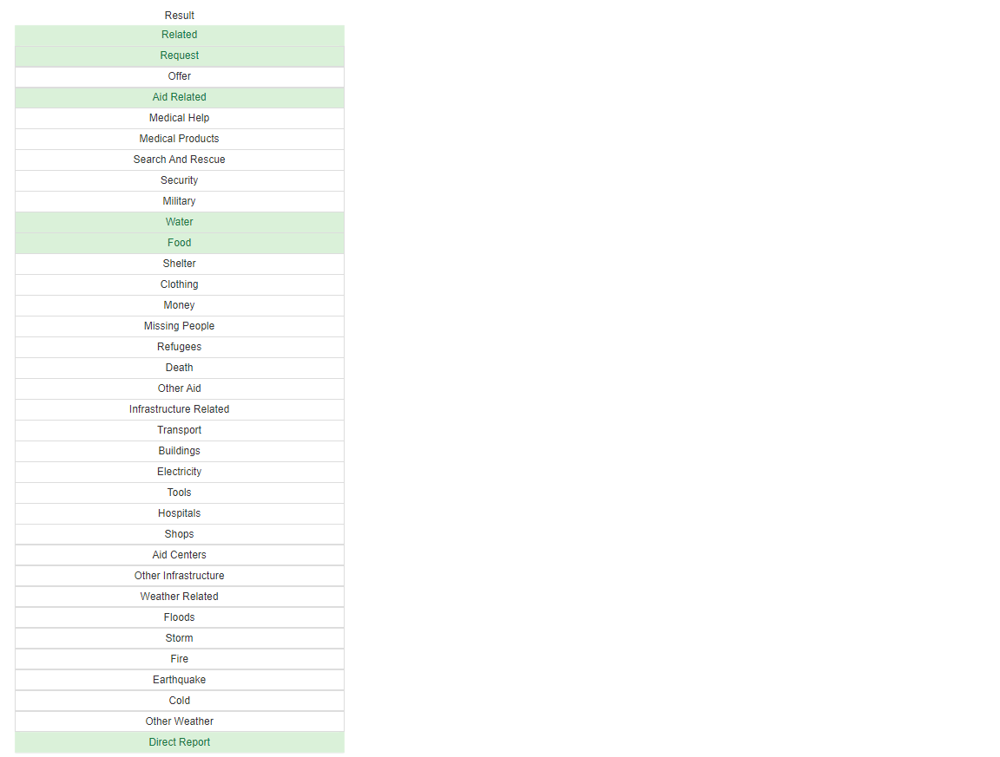

# DSND_Proj2_Disaster Response Pipeline

### Table of Contents
1. [Project Overview](#ProjectOverview)
    - [Dataset](#Dataset)
2. [Project Components](#ProjectComponents)
    2.1 ETL Pipeline
    2.2 ML Pipeline
    2.3 Flask Web App
3. [File Description](#FileDescription)
    - Requirements
4. [Instructions](#Instructions)
5. [Result](#Result)
**Warning**
**References**


## 1. Project Overview <a name="ProjectOverview"></a>
The goal of the project is to apply data engineering skills to analyze the [Disaster Response Messages](https://www.figure-eight.com/dataset/combined-disaster-response-data/) dataset provided by Figure Eight, and build a web application that can help emergency workers analyze incoming messages with the information of genres and sort them into specific categories to speed up aid and contribute to more efficient distribution of emergency personnels and other resources.

- Dataset <a name="Dataset"></a>
    - Messages are divided into three different genres(**'direct', 'news', 'social'**)
    - Each message is described to 36 different classes.
    - Class with value '1': represent that the message is classified in this class.


## 2. Project Components <a name="ProjectComponents"></a>

### 2.1 ETL Pipeline
This is a data cleaning pipeline.
- Load Messages and Categories csv datasets
- Merge the two datasets
- Wrangle the Data:
    1. `message`
        - **Tokenize** the text of the message into words
        - Use `nltk` to **normalize, lemmatize** the words, and meantime **delete the stopwords**

    2. `categories`
        - Extract the categories information from the Dataset(loaded as DataFrame)
        - Process two special categories  
            - `related`: some values are '2', change them to '1'
            - `child_alone`: there is just one unique value, useless to classfy the message, delete this categorie
- Save the cleaned data into a SQLite database

### 2.2 ML Pipeline
This is a machine learning pipeline.
- Load data from the SQLite database
- Split the dataset into training and test sets
- Build a model

    - Feature1: `message` (INPUT)
        - Use `CountVectorizer()` with tokenizer in Data Wrangling to make the words to vectors
        - Use `TfidfTransformer()` to normalize the value of the vectors

    - Feature2: `genre` (INPUT)
    !!!**GUESS**: *maybe genre is related to the classification.*
        - Use `OneHotEncoder()`, change 'genre' objects to numbers  

    - Labels: `categories` (OUTPUT)

    - **Machine Learning Pipelne**
        - Use `ColumnTransformer()`, transform the two features from different sources in one transformer called `'preprocessor'`
        - Use `Pipeline()`, build a model with transformer `'preprocessor'` and classifier `RandomForestClassifier()`
        - **Notice**: since there are many classes, use `MultiOutputClassifier()`
- Train the model using GridSearchCV
- Get the results report of the model on the test set
- Exports the final model as a pickle file

### 2.3 Flask Web App
Build a Web application by using Flask framework.


## 3 Files <a name="FileDescription"></a>
<pre>
D:.
│  .gitignore
│  LICENSE
│  README.md
│  requirements.txt
│  
├─app
│  │  run.py  //Flask file to run the web application
│  │  
│  └─templates  //contains html file for the web application
│          go.html
│          master.html
│          
├─data
│      DisasterResponse.db  // output of the ETL pipeline
│      disaster_categories.csv  // datafile of all the categories
│      disaster_messages.csv  // datafile of all the messages
│      process_data.py  //ETL pipeline scripts
│      
├─images
│      classification_accuracy.png
│      Overview.png
│      response1.png
│      response_classification.png
│      
└─models
        train_classifier.py  //machine learning pipeline scripts to train and export a classifier
</pre>

- **Requirements**
All of the requirements are captured in requirements.txt.
```python
pip install -r requirements.txt
```


## 4. Instructions <a name="Instructions"></a>
1. Run the following commands in the project's root directory to set up your database and model.

    - To run ETL pipeline that cleans data and stores in database
        ```python
        python data/process_data.py data/disaster_messages.csv data/disaster_categories.csv data/DisasterResponse.db`
        ```
    - To run ML pipeline that trains classifier and saves
        ```python
        python models/train_classifier.py data/DisasterResponse.db models/classifier.pkl df_overview.csv df_accuracy.csv`
        ```

2. Run the following command in the app's directory to run your web app.
    ```python
    run.py
    ```

3. Go to http://localhost:3001

## 5. Result: <a name="Result"></a>
1. Model accuracy of different classes:

2. Web APP:





# Warning
1. Develop enev  
Latest python module of `joblib`  
update:
```py
import joblib #old version: from sklearn.externals import joblib
```

# References
1. https://github.com/binliu-base/dsnd-term2-p1-disaster-response
